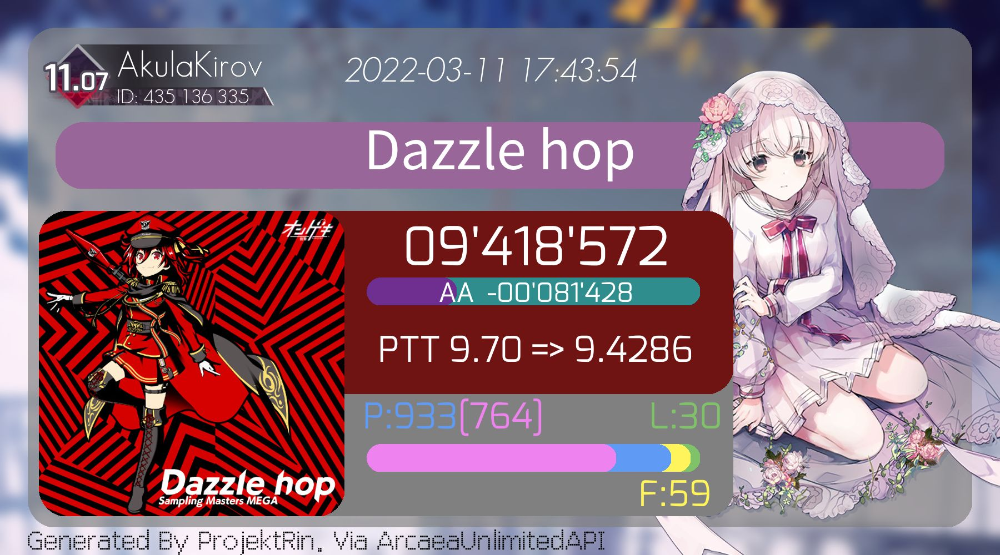
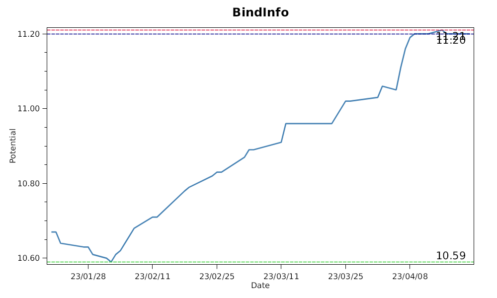
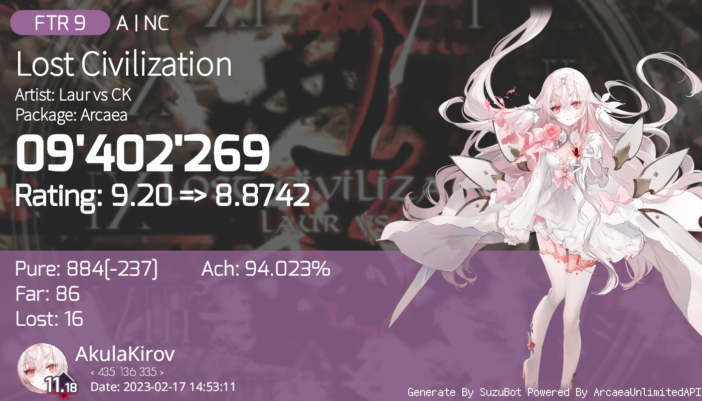

# Arcaea 模块发展历史

## 2020 年 3 月

那个时候入坑了 "创新立体节奏游戏" `Arcaea`, 于是就顺水推舟的给 Bot 加上了 Arcaea 查分功能

数据是从 [esterTion](https://redive.estertion.win/arcaea/probe/) 那爬的, 因此获取速度非常慢(60s +)  
当时还手搓了半天 ws 解析, 直到看到水鱼的 [ArcaeaBot](https://github.com/Diving-Fish/ArcaeaBot)(

图片格式仿造 `软糖酱` 的 5*6 横版布局, 不同的在于用户信息栏放在左侧, 且左上角留出一块用于放潜力值变化曲线图

当时功能极其简陋, 只能生成 Best30, 不过也就我自己一个人用()

 
第一版本 Best30

## 2022 年 1 月

在尝试下投入公开使用过后, 决定为 Arcaea 功能重新搞一套新的 UI

机缘巧合下, 接触到了 `Arcaea-Infinity`, 瞬间有一种找到组织了的感觉

随即将先前的接口全部移植到 `ArcaeaUnlimitedAPI` 上, 同时更新了 Best30 的图查界面

 
第二版本 Best30

## 2022 年 3 月

先后完成了 `Best` `Recent` `SongInfo` `SongScore` 等常用图查功能

 
第二版本 Recent

实验性的添加了 `Recommend` 推荐推歌功能

作用是按照用户的当前潜力值和 Best30 地板歌曲的潜力值推算出一个可行推分歌曲区间  
再计算当歌曲成绩达到 `EX/EX+` 时, 能不能对当前潜力值造成影响  
经过两轮筛选后, 从集合里随机一首歌返回给用户

该功能推出后受到用户一致好评(指每次都会推荐风暴FTR)  
但是由于算法太过于简单, 在一次重构后被无限期咕咕(

同时利用本地缓存的用户潜力值数据, 复刻了原先第一版本的潜力值变化曲线图 `BindInfo`  
这个界面一开始只是测试用的, 但是后面懒得搞 UI 了就直接上线了(

 
第二版本 BindInfo

### 小插曲

当时发生了一件轰动整个 Arcaea 圈子的事情: 节奏大师直接将 `1f1e33` 这一 Arcaea 独占曲给盗用了

当时有感而发, 随手P了张图(文案和图都是我弄的 可惜原PSD没保存下来)

 
查看图片

其实还本来打算P一个红色电音极地大冲击搭档图的, 后面摸了(

## 2022 年 11 月

重命名 Bot 名字为 `SuzuBot`, 顺便重构了一堆东西, 其中也包括 Arcaea 模块的 UI

灵感来源其实是 `osu!` 的官网歌曲界面

 
第三版本 Best30

 
第三版本 Recent

同时实装了由 `Stable-Difussion` 处理后的猫娘歌曲封面 [Arcanya](https://github.com/Arcaea-Infinity/Arcanya)

## 2023 年 4 月

Lowiro 正式实装了官方的查分器 `Arcaea Online`, 至此 `ArcaeaUnlimitedAPI` 停止服务

`SuzuBot` 的 Arcaea 模块生命周期也就此停止, 爷青结

> So fuck you Lowiro!

## 一些想说的话

`Arcaea` 第一款长期游玩的音游, 也是我其他音游的引路人

在此期间收获了很多快乐, 也认识了一些几乎改变我一生的人

如果不是 `Arcaea`, 我也不会和 `Arcaea-Infinity` 的各位认识

### 特别感谢

- [Arcaea-Infinity](https://github.com/Arcaea-Infinity)
    
    Arcaea 领域的 GNU  
    这里是梦开始的地方, 我认识其他开发者的地方, 一个真正能找到志同道合之人的地方  
    默默无闻的贡献着 `ArcaeaUnlimitedAPI` 这一重要后端, 却很少被人提及

- [TheSnowfield](https://github.com/TheSnowfield)
 
    提供了 Konata 框架、Kagami 项目参考、等等，仅一言难以穷尽对我的支持和帮助  
    如果不是湖精姐指点, 我可能还是一个半桶水的 C# 程序员 (虽然现在还是x)

- [InariAimu](https://github.com/InariAimu)

    抄了多平台框架的实现和文档相关的内容  
    \\\\Aimu出道//

- ...

希望即使不再继续官方 Arcaea 相关的开发, 各位也能在自己的领域发散光彩

